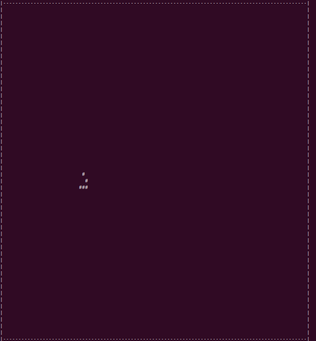
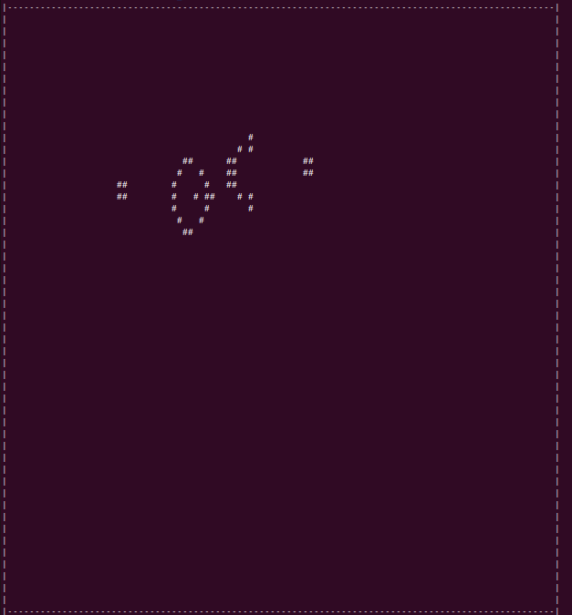
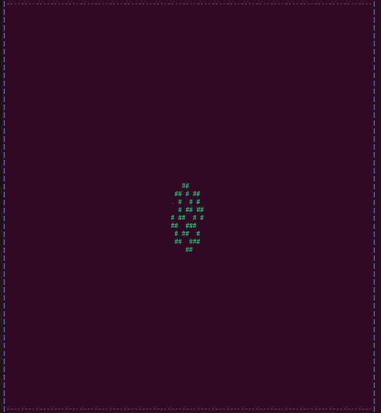
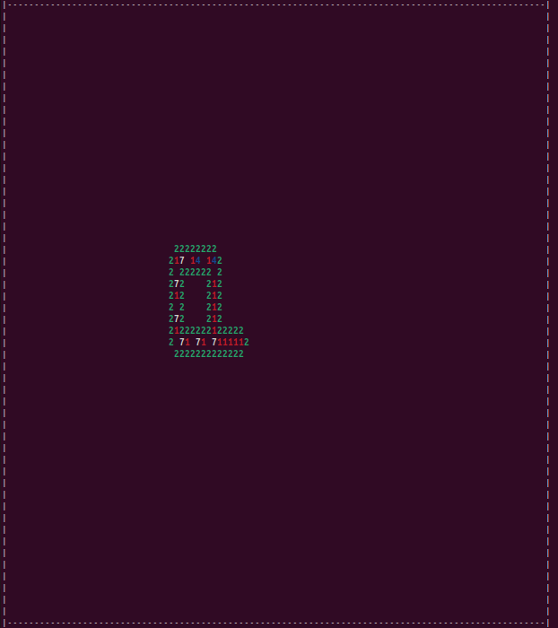
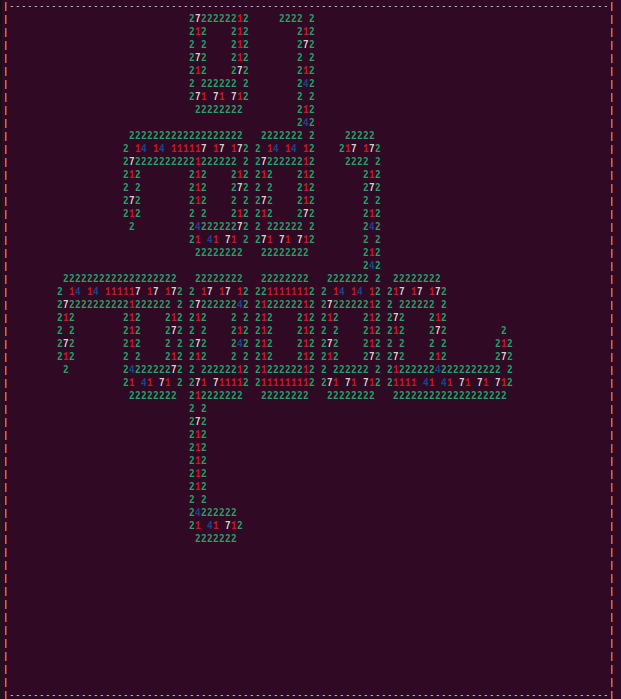

# Projet-C-ESIEA-2024-2025

## Information

This repository contains some of my C projects that I did in 2024 during my studies.
It contains 4 programming projects about Cellular Automata:

- Conway's Game of Life
- Conway's Game of Life with pattern reading from a file
- Fibonacci Spiral
- Langton's Loop

## Compilation and Execution

To compile each of these projects, type one of the following:

```bash
user@Ubuntu:~/Documents/project$ gcc -Werror *.c -O2 -o prog.exe
```

OR

```bash
user@Ubuntu:~/Documents/project$ gcc -Wall *.c -o prog.exe
```

To run a program, type the following:
```bash
user@Ubuntu:~/Documents/project$ ./prog.exe
```

Then, add the correct command line parameters specific to the project you want to run.
Basically, the '-all' option shows all iterations, while the '-last' option only shows the last one.

## Memory handling

These projects have no memory leaks. They are clean on valgrind.
You are free to verify with this command:

```bash
user@Ubuntu:~/Documents/project$ valgrind --leak-check=full --track-origins=yes ./prog.exe 100 -last
```

Just make sure that you use the right command line arguments for each project.

## Visuals

### Conway's Game of Life
```bash
user@Ubuntu:~/Documents/project$ ./prog.exe 100 -last
```



### Conway's Game of Life with pattern reading from a file
```bash
user@Ubuntu:~/Documents/project$ ./prog.exe pattern.txt 100 -last
```



### Fibonacci Spiral
```bash
user@Ubuntu:~/Documents/project$ ./prog.exe 100 -last
```



### Langton's Loop

Starting pattern:
```bash
user@Ubuntu:~/Documents/project$ ./prog.exe pattern.txt 0 -last
```



After 500 iterations for example:
```bash
user@Ubuntu:~/Documents/project$ ./prog.exe pattern.txt 500 -last
```


